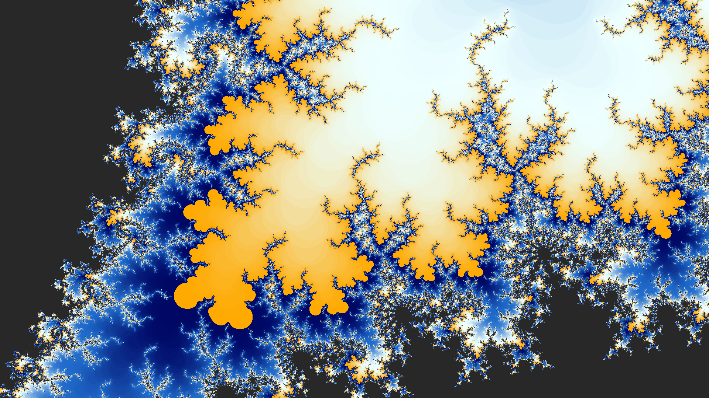
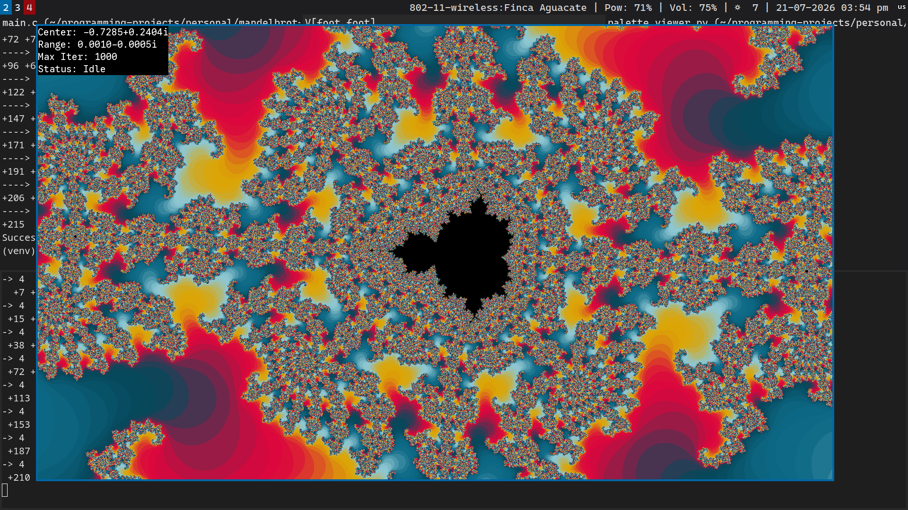
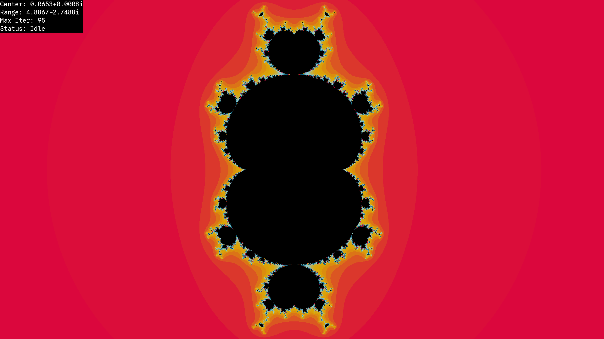
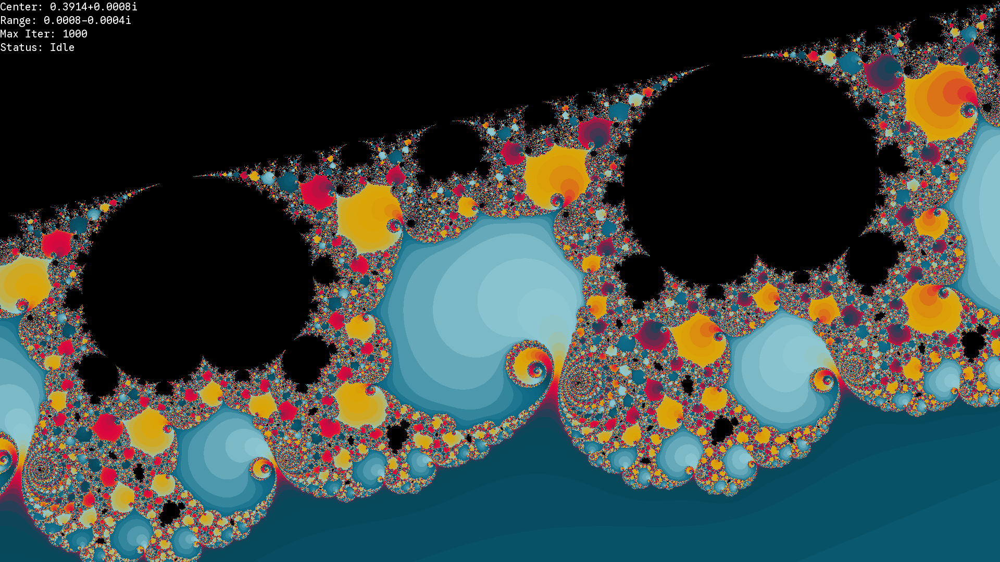
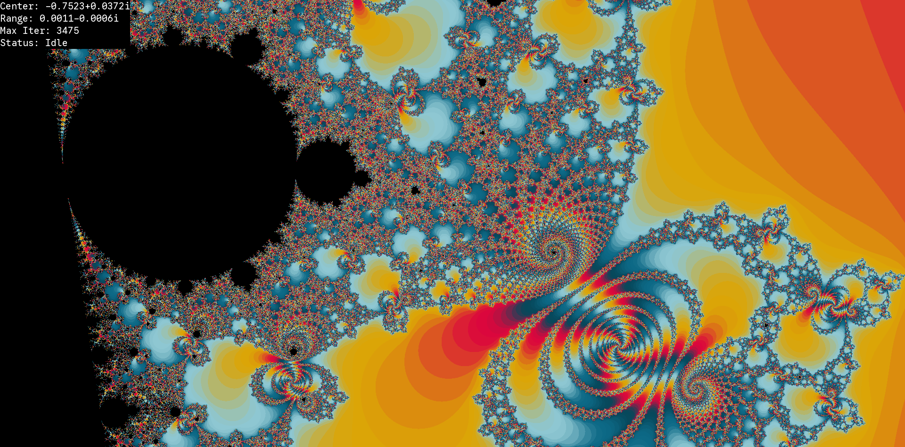
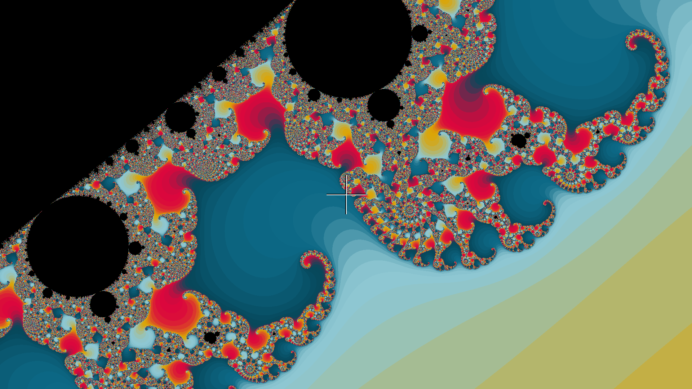
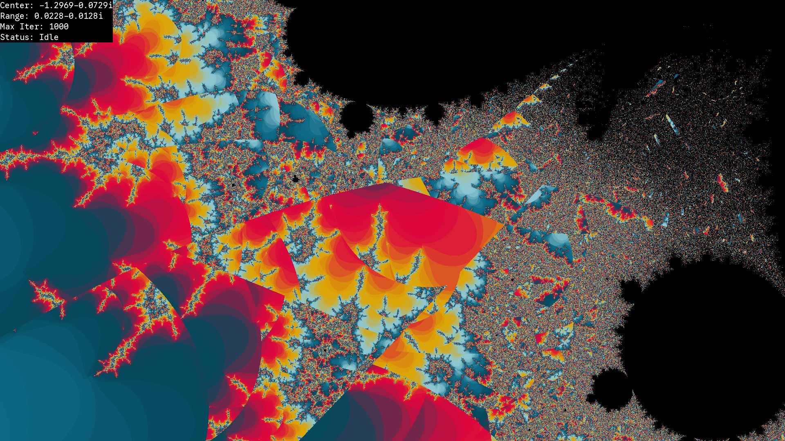

# Mandelbrot Fractal Explorer
A fully interactive written in C Mandelbrot Fractal Explorer using SDL3 + Python Script to visualize color palettes.

## Features
- Written in pure C!
- Dynamic color palette
- Interactive (allows moving, zooming and changing max iterations) through keyboard and mouse
- Save images as .png
- Information rectangle at the top-left
- Pointer at the center of screen to see where are you zooming
- Modify program through command line arguments
- Select any complex $p$ and render $z_{n+1} = z_{n}^p + c$
- Little Python Script to visualize color palettes

## Dependencies 
- C compiler
- `make`
- [`SDL3`](https://libsdl.org/)
- `SDL3\_image`
- `SDL3\_ttf`
- `Pillow` (just for Python Script, not necessary)

## Building
1. Install dependencies
2. Run `make` from root of the project
3. Run the binary `./bin/mandelbrot` 

## Command Line Arguments

MISSING TO WRITE

## Usage

MISSING TO WRITE
